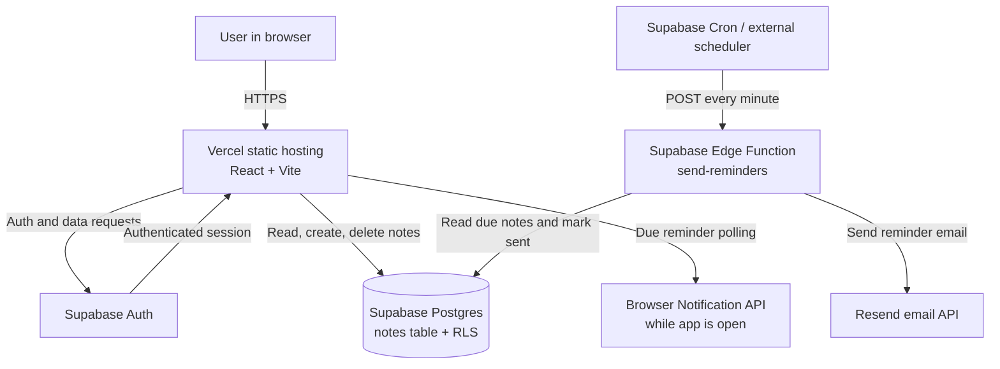

# The Marginalia

The Marginalia is a small, private blogging app for capturing thoughts and
setting reminders. It is built with React, TypeScript, Vite, and Supabase.
Authenticated users can create, view, and delete their own notes, optionally
set a reminder, and receive browser notifications while the app is open.

## Links

- **Live application:** [https://postgres-plum.vercel.app/](https://postgres-plum.vercel.app/)
- **Demo video:** _Add the demo video link here._

## Features

- Email/password sign up and sign in with Supabase Auth
- User details and sign-out control in the header
- Private notes stored in Supabase Postgres
- Row-level security so users can access only their own notes
- Optional reminder date and time on every note
- Browser notifications for due reminders while the app is open
- Optional background email reminders through a Supabase Edge Function and Resend

## Architecture



### Request and data flow

1. Vercel serves the compiled Vite application.
2. The browser creates a Supabase client using the public `VITE_*` variables.
3. Supabase Auth manages the session and returns the authenticated user.
4. The app reads and writes the `notes` table. Postgres row-level security
   restricts each operation to the signed-in user's `user_id`.
5. Browser reminders are checked locally every 30 seconds after notification
   permission is granted.
6. Optional email reminders are handled separately by the
   `send-reminders` Edge Function. A scheduler calls it, the function sends
   due reminders through Resend, and then records `reminder_sent_at`.

## Prerequisites

- Node.js 20 or newer
- npm
- A Supabase project
- Optional: a Resend account and a scheduler for background email reminders

## Local setup

1. Clone the repository and enter the project directory:

   ```bash
   git clone https://github.com/Pavani3001/postgres-project-The-Marginalia.git
   cd postgres-project-The-Marginalia
   ```

2. Create a Supabase project.

3. In the Supabase dashboard, open **Authentication > Providers** and enable
   **Email**. Keep email confirmation enabled if you want users to verify their
   email address before signing in.

4. Copy the environment template:

   ```bash
   copy .env.example .env.local
   ```

   On macOS/Linux, use `cp .env.example .env.local`.

5. Open `.env.local` and set the Supabase URL and anon key:

   ```text
   VITE_SUPABASE_URL=https://your-project.supabase.co
   VITE_SUPABASE_ANON_KEY=your-anon-key
   ```

   Find both values in the Supabase dashboard under **Project Settings >
   API**. Never put a Supabase service-role key in `.env.local` or expose it in
   the browser.

6. In the Supabase dashboard, open **SQL Editor**, paste the complete contents
   of [`supabase/schema.sql`](./supabase/schema.sql), and run it once. This
   creates the notes table, reminder fields, index, and row-level security
   policies.

7. Install dependencies and start the development server:

   ```bash
   npm install
   npm run dev
   ```

8. Open the local URL printed by Vite, usually
   `http://localhost:5173`.

When email confirmation is enabled, a new user must confirm the email address
from their inbox before signing in.

## Vercel deployment

1. Import the repository into [Vercel](https://vercel.com/).
2. Select **Vite** as the framework if Vercel does not detect it
   automatically.
3. Add these variables in **Project Settings > Environment Variables** for the
   **Production**, **Preview**, and **Development** environments as needed:

   ```text
   VITE_SUPABASE_URL=https://your-project.supabase.co
   VITE_SUPABASE_ANON_KEY=your-anon-key
   ```

4. Use `npm run build` as the build command and `dist` as the output
   directory, if Vercel does not fill them in automatically.
5. Deploy or redeploy the project. Vite embeds `VITE_*` variables at build
   time, so changing them requires a new deployment.
6. In Supabase, add the deployed URL to **Authentication > URL Configuration**
   as the site URL and an allowed redirect URL if required by your auth setup.

The current deployed application is
[https://postgres-plum.vercel.app/](https://postgres-plum.vercel.app/).

## Optional background email reminders

Browser notifications work without this section, but they require the app to
remain open. The Edge Function provides reminders by email when the app is
closed.

1. Install or run the Supabase CLI through `npx`, then authenticate:

   ```bash
   npx supabase login
   npx supabase link --project-ref YOUR_PROJECT_REF
   ```

2. Deploy the function:

   ```bash
   npx supabase functions deploy send-reminders
   ```

3. Configure function-only secrets. These values must not be exposed as
   `VITE_*` variables:

   ```bash
   npx supabase secrets set \
     RESEND_API_KEY=your-resend-key \
     REMINDER_FROM_EMAIL=reminders@your-domain.com \
     CRON_SECRET=choose-a-secret
   ```

4. Configure Supabase Cron, GitHub Actions, or another scheduler to send a
   `POST` request every minute to:

   ```text
   https://YOUR_PROJECT_REF.supabase.co/functions/v1/send-reminders
   ```

   Include the same secret in the request:

   ```text
   x-cron-secret: choose-a-secret
   ```

5. Verify that the sender address is authorized in Resend. The function finds
   due notes that have not been sent, sends each email, and updates
   `reminder_sent_at`.

## Available commands

| Command | Purpose |
| --- | --- |
| `npm run dev` | Start the local Vite development server |
| `npm run build` | Run TypeScript checks and create a production build |
| `npm run lint` | Check source files with Oxlint |
| `npm run preview` | Preview the production build locally |

Run the checks before opening a pull request:

```bash
npm run lint
npm run build
```

## Project structure

```text
.
├── src/
│   ├── lib/supabase.ts       # Supabase client configuration
│   ├── App.tsx               # Auth, notes, and reminder UI logic
│   ├── App.css               # App-specific styles
│   └── main.tsx              # React entry point
├── supabase/
│   ├── schema.sql            # Database schema and RLS policies
│   └── functions/
│       └── send-reminders/   # Optional email reminder function
├── public/                   # Static assets
├── .env.example              # Required client-side environment variables
└── package.json              # Scripts and dependencies
```

## Troubleshooting

- **Authentication is disabled:** Confirm both `VITE_SUPABASE_URL` and
  `VITE_SUPABASE_ANON_KEY` are present in `.env.local`, then restart Vite.
- **Notes cannot be loaded or saved:** Run the complete
  [`supabase/schema.sql`](./supabase/schema.sql) script in the Supabase SQL
  Editor and confirm the app is using the same project URL.
- **No browser reminder appears:** Allow notifications for the site and keep
  the application tab open. Browser reminders are intentionally client-side.
- **Email reminders are not sent:** Check the Edge Function logs, confirm all
  function secrets are set, verify the Resend sender domain, and confirm the
  scheduler sends `POST` with the correct `x-cron-secret` header.
